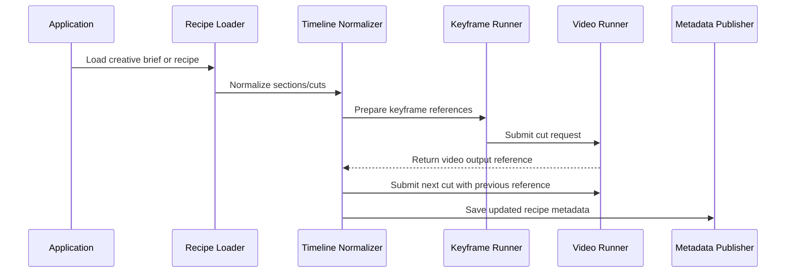

# 🎬 AI Video Timeline Orchestrator

[](https://golang.org/)
[](https://golang.org/)
[](LICENSE)
[](#)

## 🚀 概要 (About) - 音楽・ストーリー設計を動画生成タイムラインへ変換するオーケストレーター

**AI Video Timeline Orchestrator** は、音楽やストーリーをもとにした構造化レシピを、AI動画生成向けのタイムラインへ変換するための Go 製リファレンス実装です。

単なるサンプルコードではなく、「**音楽起点のカット設計**」「**前カット出力を次カットへ引き継ぐ連続性管理**」「**生成済みメタデータによる再開・リトライ設計**」「**プロバイダー非依存の Adapter Boundary**」といった、AI動画生成ワークフローで実用上必要になる設計要素を、公開可能な最小構成として整理しています。

このリポジトリは、特定の動画生成サービスに依存しない公開用アーキテクチャを示すことを目的としています。実運用で使う provider-specific adapter、production prompt、クラウド設定、キュー worker、認証情報、独自の生成戦略は含めていません。

---

## ✨ 主な特徴 (Features)

* **🎼 Music-Driven Timeline**:
  * `VideoRecipe` に含まれる tempo、mood、audio cue、cut-level prompt をもとに、動画生成に渡しやすいカット単位のタイムラインを表現します。
* **🎞️ Cut-Based Video Workflow**:
  * 各 `VideoCut` は duration、visual prompt、audio reference、keyframe reference、seed、character ID を保持し、1カットずつ生成処理へ渡せます。
* **🔁 Continuity Chaining**:
  * `PreviousVideoRef` と `GeneratedVideoRef` により、前カットの出力を次カットの入力として扱う設計をサポートします。
* **🧩 Provider-Neutral Adapter Boundary**:
  * 動画生成処理は `VideoRunner` インターフェースに分離。Gemini、Veo、Runway、Luma、独自バックエンドなどの実装は adapter として差し替えられます。
* **🧭 Resumable Metadata Model**:
  * `pending` / `generated` / `failed` の `CutStatus` を使い、生成済みカットのスキップや失敗カットの再処理をアプリケーション側で構成できます。
* **🧪 Deterministic Mock Runner**:
  * 公開サンプルには `MockVideoRunner` を同梱し、外部APIなしで request/response の流れとテストを確認できます。
* **🛡️ Public-Safe Architecture**:
  * 本番プロンプト、プロバイダー固有 payload、認証、bucket path、queue worker、retry policy などの秘匿すべき要素を含めない構成です。

---

## 🧭 Public API

```go
// 1つの動画生成バックエンドを表す adapter boundary
type VideoRunner interface {
    Run(ctx context.Context, req VideoRequest) (*VideoResponse, error)
}

// 生成後の recipe metadata を保存する publisher boundary
type MetadataPublisher interface {
    Publish(ctx context.Context, recipe VideoRecipe) error
}

// VideoCut から provider-neutral な VideoRequest を生成
VideoRequestFromCut(cut VideoCut, previousVideoRef string) VideoRequest
```

### Core Types

```go
type VideoRecipe struct {
    Title    string
    Theme    string
    Mood     string
    TempoBPM int
    Cuts     []VideoCut
}

type VideoCut struct {
    Index             int
    DurationSec       float64
    AudioCue          string
    AudioReference    string
    VisualPrompt      string
    KeyframeReference string
    CharacterID       string
    Seed              uint32
    PreviousVideoRef  string
    GeneratedVideoRef string
    GeneratedVideoURL string
    Status            CutStatus
}
```

---

## 🚀 Quick Start

### 1. Mock Runner で1カットを生成する

```go
package main

import (
    "context"
    "log"

    "github.com/example/ai-video-timeline-orchestrator/pkg/orchestrator"
)

func main() {
    ctx := context.Background()
    runner := orchestrator.MockVideoRunner{}

    recipe := orchestrator.VideoRecipe{
        Title:    "Neon Rain",
        Theme:    "finding clarity in a noisy city",
        Mood:     "cinematic synthwave, emotional, luminous",
        TempoBPM: 120,
        Cuts: []orchestrator.VideoCut{
            {
                Index:        1,
                DurationSec:  6,
                AudioCue:     "soft synth pulse begins at the intro",
                VisualPrompt: "a lone protagonist walks through reflective neon rain, close-up on determined eyes",
                CharacterID:  "main",
                Seed:         42,
            },
        },
    }

    req := orchestrator.VideoRequestFromCut(recipe.Cuts[0], "")
    res, err := runner.Run(ctx, req)
    if err != nil {
        log.Fatal(err)
    }

    log.Printf("generated cut=%d ref=%s url=%s", res.CutIndex, res.VideoRef, res.VideoURL)
}
```

### 2. 前カットの出力を次カットへ引き継ぐ

```go
previousRef := ""

for i, cut := range recipe.Cuts {
    req := orchestrator.VideoRequestFromCut(cut, previousRef)

    res, err := runner.Run(ctx, req)
    if err != nil {
        recipe.Cuts[i].Status = orchestrator.CutStatusFailed
        continue
    }

    recipe.Cuts[i].GeneratedVideoRef = res.VideoRef
    recipe.Cuts[i].GeneratedVideoURL = res.VideoURL
    recipe.Cuts[i].Status = orchestrator.CutStatusGenerated

    previousRef = res.VideoRef
}
```

### 3. Example Recipe を使う

`examples/recipe.example.json` には、音楽的な mood / tempo / audio cue と、カット単位の visual prompt を含む最小レシピを配置しています。

```json
{
  "title": "Neon Rain",
  "theme": "finding clarity in a noisy city",
  "mood": "cinematic synthwave, emotional, luminous",
  "tempo_bpm": 120,
  "cuts": [
    {
      "index": 1,
      "duration_sec": 6,
      "audio_cue": "soft synth pulse begins at the intro",
      "visual_prompt": "a lone protagonist walks through reflective neon rain, close-up on determined eyes",
      "character_id": "main",
      "seed": 42
    }
  ]
}
```

---

## 🏗️ Architecture - Provider-neutral AI Video Timeline Orchestration

詳細版は [`docs/architecture.md`](docs/architecture.md) に配置しています。

### Flow



### Step Details

1. `Application` が creative brief または serialized recipe を読み込みます。
2. `Recipe Loader` が `VideoRecipe` として title、theme、mood、tempo、cuts を復元します。
3. `Timeline Normalizer` が sections や cuts を、生成しやすい順序付き timeline に整えます。
4. `Keyframe Runner` が必要に応じて `KeyframeReference` を作成または添付します。
5. `Video Runner` が `VideoRequest` を受け取り、provider-specific な動画生成処理を実行します。
6. `Timeline` は `VideoResponse` から `GeneratedVideoRef` / `GeneratedVideoURL` を更新します。
7. 次の cut には前 cut の `GeneratedVideoRef` を `PreviousVideoRef` として渡します。
8. `Metadata Publisher` が更新済みの `VideoRecipe` を保存します。

### Public Boundary

公開 API は、安定したドメイン概念だけを扱います。

* `VideoRecipe`
* `VideoCut`
* `VideoRequest`
* `VideoResponse`
* `VideoRunner`
* `MetadataPublisher`

実際の動画生成 API に必要な認証、HTTP payload、polling、rate limit、storage、retry policy は、別 adapter または private package に隔離する想定です。

### Continuity Strategy

カット間の連続性は、provider-specific な詳細ではなく reference chaining として表現します。

```go
req := orchestrator.VideoRequestFromCut(cut, previousVideoRef)
```

`previousVideoRef` が指定されている場合は、それを優先して `VideoRequest.PreviousVideoRef` に設定します。指定がない場合は、`VideoCut.PreviousVideoRef` を fallback として使います。

### Resume Strategy

生成状態は `CutStatus` で表現します。

* `pending`: まだ生成が必要なカット
* `generated`: 生成済みのためスキップ可能なカット
* `failed`: アプリケーション側の方針に従って再試行するカット

このリポジトリはフィールドと境界を定義するのみで、本番用の queue、retry、resume 実装は含みません。

### Adapter Implementation Pattern

本番 adapter は `VideoRunner` を実装します。

```go
type ProviderVideoRunner struct {
    // client, storage, logger, retry policy, and configuration live here.
}

func (r *ProviderVideoRunner) Run(ctx context.Context, req orchestrator.VideoRequest) (*orchestrator.VideoResponse, error) {
    // 1. Convert provider-neutral request into provider-specific payload.
    // 2. Submit generation request.
    // 3. Poll or wait for completion.
    // 4. Store or normalize output reference.
    // 5. Return provider-neutral response.
    return &orchestrator.VideoResponse{}, nil
}
```

---

## 📂 プロジェクト構造 (Project Structure)

```text
ai-video-timeline-orchestrator/
├── docs/
│   └── architecture.md          # Provider-neutral な生成フローと境界設計
├── examples/
│   └── recipe.example.json      # 音楽・ストーリー起点のサンプルレシピ
├── pkg/
│   └── orchestrator/
│       ├── interfaces.go        # VideoRunner / MetadataPublisher
│       ├── mock_runner.go       # 外部APIなしで動く deterministic runner
│       ├── mock_runner_test.go  # Mock runner と request mapping のテスト
│       └── types.go             # Recipe / Cut / Request / Response の型定義
├── go.mod
├── LICENSE
└── README.md
```

---

## 🚫 含めていないもの (Not Included)

この public sample には、以下を意図的に含めていません。

* production video API adapters
* provider-specific request payloads
* production prompt templates
* deployment configuration
* cloud project names or bucket paths
* authentication/session implementation
* queue worker implementation
* proprietary retry, chaining, or publishing strategy

---

## 📜 ライセンス (License)

このプロジェクトは [MIT License](LICENSE) の下で公開されています。
