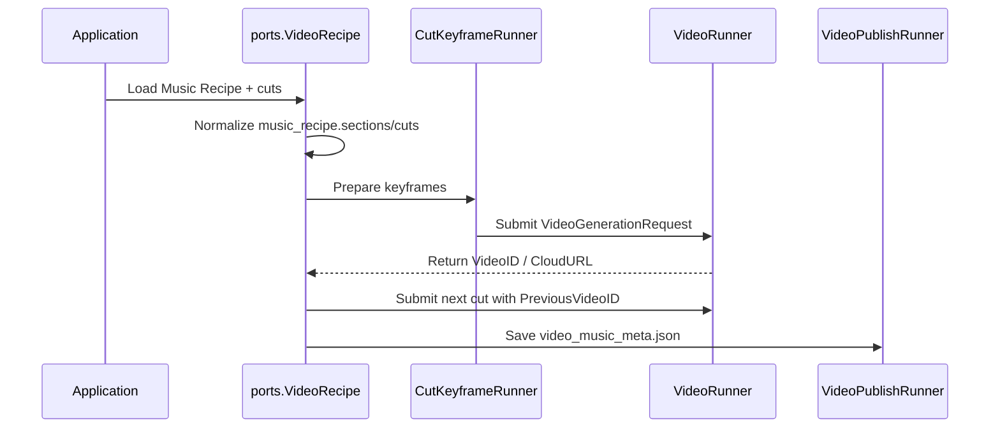

# 🎬 AI Video Timeline Orchestrator

[](https://golang.org/)
[](https://golang.org/)
[](LICENSE)
[](#)

## 🚀 概要 (About)

**AI Video Timeline Orchestrator** は、[`github.com/shouni/go-veo-orchestrator`](https://github.com/shouni/go-veo-orchestrator) のワークフローライブラリを見せるためのショーケースです。

この repo では production adapter や秘匿プロンプトを持たず、`go-veo-orchestrator/ports` の公開インターフェイスをそのまま使って、Music Recipe から Veo 向けのカット生成タイムラインへつなぐ設計を説明します。

### Documentation

* [Architecture](docs/architecture.md): `go-veo-orchestrator/ports` と一致させている境界、`VideoRecipe` / `Cut` / runner interfaces、生成フローの詳細。
* [Example Recipe](examples/recipe.example.json): `ports.VideoRecipe` として読み込める `music_recipe` + `cuts` の最小サンプル。

---

## ✨ 主な特徴 (Features)

* **🎼 Music Recipe Driven Timeline**:
  * `ports.VideoRecipe` の `music_recipe.sections` と `cuts` をもとに、音楽展開と映像カットを同じメタデータで扱います。
* **🎞️ Cut-Based Video Workflow**:
  * 各 `ports.Cut` は `duration_sec`、`audio_cue`、`visual_anchor`、`keyframe_reference`、`video_id`、`video_url` を保持します。
* **🔁 Continuity Chaining**:
  * `ports.VideoGenerationRequest.PreviousVideoID` に前カットの `VideoID` を渡し、Video-to-Video の文脈を維持します。
* **🧩 Upstream-Compatible API**:
  * `pkg/orchestrator` は `go-veo-orchestrator/ports` の型 alias です。ショーケース側で独自の構造体を再定義しません。
* **🧪 Deterministic Mock Runner**:
  * `MockVideoRunner` で `ports.VideoRunner` を実装し、外部 API なしで request/response の流れをテストできます。

---

## 🧭 Public API

この package の主要型は `go-veo-orchestrator/ports` と同一です。

```go
type VideoRecipe = ports.VideoRecipe
type MusicRecipe = ports.MusicRecipe
type Section = ports.Section
type Lyrics = ports.Lyrics
type Cut = ports.Cut
type VideoCut = ports.Cut
type Cuts = ports.Cuts

type VideoGenerationRequest = ports.VideoGenerationRequest
type VideoResponse = ports.VideoResponse
type VideoRunner = ports.VideoRunner
type VideoTimelineRunner = ports.VideoTimelineRunner
type PublishResult = ports.PublishResult
type Config = ports.Config
```

### Core Types

```go
type VideoRecipe struct {
    ProjectTitle string
    Description  string
    MusicRecipe  MusicRecipe
    Cuts         []Cut
}

type MusicRecipe struct {
    Title       string
    Theme       string
    Mood        string
    Tempo       int
    Instruments []string
    Sections    []Section
    Lyrics      *Lyrics
    AudioModel  string
    ComposeMode string
    Seed        int64
}

type Cut struct {
    CutIndex          int
    DurationSec       float64
    AudioCue          string
    AudioReference    string
    VisualAnchor      string
    CharacterID       string
    Dialogue          string
    KeyframeReference string
    VideoURL          string
    VideoID           string
    Status            CutStatus
    StartSec          float64
    EndSec            float64
}

type VideoGenerationRequest struct {
    Prompt          string
    ImageReference  string
    // ReferenceImages は複数の参照画像 GCS URI（最大3枚）。セット時は ImageReference より優先。
    ReferenceImages []string
    AudioReference  string
    InputImage      []byte
    InputAudio      []byte
    // PreviousVideoID は前カットの Video-to-Video 文脈維持用。VeoUsePreviousVideo 有効時のみ使用。
    PreviousVideoID string
    Seed            int64
    CutIndex        int
    DurationSec     float64
}
```

---

## 🚀 Quick Start

### 1. Mock Runner で1カットを生成する

```go
package main

import (
    "context"
    "log"

    "github.com/shouni/ai-video-timeline-orchestrator/pkg/orchestrator"
)

func main() {
    ctx := context.Background()
    runner := orchestrator.MockVideoRunner{}

    req := orchestrator.VideoGenerationRequest{
        Prompt:      "a lone protagonist walks through reflective neon rain",
        DurationSec: 6,
        CutIndex:    1,
    }

    res, err := runner.Run(ctx, req)
    if err != nil {
        log.Fatal(err)
    }

    log.Printf("generated cut=%d id=%s url=%s", res.CutIndex, res.VideoID, res.CloudURL)
}
```

### 2. 前カットの VideoID を次カットへ引き継ぐ

```go
recipe.Normalize()

lastVideoID := ""
for i := range recipe.Cuts {
    cut := &recipe.Cuts[i]
    if cut.IsGenerated() {
        lastVideoID = cut.VideoID
        continue
    }

    req := orchestrator.VideoGenerationRequest{
        Prompt:          cut.VisualAnchor,
        ImageReference:  cut.KeyframeReference,
        AudioReference:  cut.AudioReference,
        PreviousVideoID: lastVideoID,
        CutIndex:        cut.CutIndex,
        DurationSec:     cut.DurationSec,
    }

    res, err := runner.Run(ctx, req)
    if err != nil {
        cut.Status = orchestrator.CutStatusFailed
        continue
    }

    cut.VideoID = res.VideoID
    cut.VideoURL = res.CloudURL
    cut.Status = orchestrator.CutStatusGenerated
    lastVideoID = res.VideoID
}
```

### 3. Example Recipe を使う

`examples/recipe.example.json` は `go-veo-orchestrator/ports.VideoRecipe` として読み込める最小レシピです。

```json
{
  "project_title": "Neon Rain",
  "description": "finding clarity in a noisy city",
  "music_recipe": {
    "title": "Neon Rain",
    "theme": "finding clarity in a noisy city",
    "mood": "cinematic synthwave, emotional, luminous",
    "tempo": 120,
    "sections": [
      {
        "name": "Intro",
        "duration": 6,
        "prompt": "soft synth pulse begins at the intro"
      }
    ]
  },
  "cuts": [
    {
      "cut_index": 1,
      "duration_sec": 6,
      "audio_cue": "soft synth pulse begins at the intro",
      "visual_anchor": "a lone protagonist walks through reflective neon rain, close-up on determined eyes",
      "character_id": "main",
      "status": "pending",
      "start_sec": 0,
      "end_sec": 6
    }
  ]
}
```

---

## 🏗️ Architecture

詳細版は [`docs/architecture.md`](docs/architecture.md) に配置しています。



### Public Boundary

この repo の境界は `go-veo-orchestrator/ports` に合わせています。

* `VideoRecipe`
* `Cut`
* `VideoGenerationRequest`
* `VideoResponse`
* `VideoRunner`
* `CutKeyframeRunner`
* `VideoPublishRunner`

実際の動画生成 API に必要な認証、HTTP payload、polling、rate limit、storage、retry policy は、本番 adapter 側へ隔離します。

---

## 📂 プロジェクト構造 (Project Structure)

```text
ai-video-timeline-orchestrator/
├── docs/
│   └── architecture.md          # go-veo-orchestrator ports に合わせた設計メモ
├── examples/
│   └── recipe.example.json      # ports.VideoRecipe として読めるサンプル
├── pkg/
│   └── orchestrator/
│       ├── types.go             # go-veo-orchestrator/ports の型 alias
│       ├── mock_runner.go       # ports.VideoRunner の deterministic mock
│       ├── config_test.go       # upstream Config helper のテスト
│       ├── example_test.go      # example recipe の読み込みテスト
│       ├── mock_runner_test.go  # mock runner / normalize のテスト
│       └── upstream_test.go     # ports との型一致確認
├── go.mod
├── go.sum
├── LICENSE
└── README.md
```

---

## 🚫 含めていないもの (Not Included)

この showcase には、以下を意図的に含めていません。

* production video API adapters
* provider-specific request payloads
* production prompt templates
* deployment configuration
* cloud project names or bucket paths
* authentication/session implementation
* queue worker implementation
* proprietary retry, chaining, or publishing strategy

---

## 📜 ライセンス (License)

このプロジェクトは [MIT License](LICENSE) の下で公開されています。
