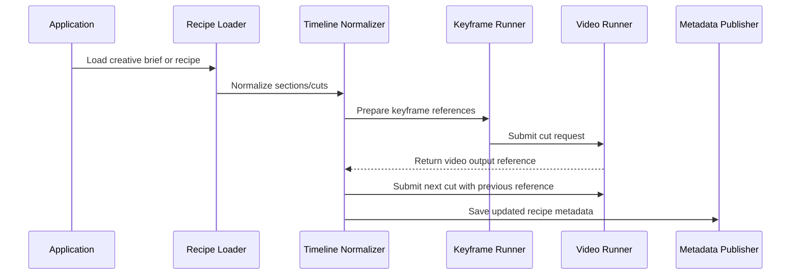

# Architecture

This sample describes a provider-neutral AI video timeline orchestration flow.

## Flow

## Boundaries

The public API should expose only stable concepts:

- `VideoRecipe`
- `VideoCut`
- `VideoRequest`
- `VideoResponse`
- `VideoRunner`
- `MetadataPublisher`

Provider-specific code should stay private or live in separate adapter packages.

## Resume Strategy

A production orchestrator can resume work by checking cut status:

- `pending`: needs generation
- `generated`: skip and use existing output reference
- `failed`: retry according to application policy

The public sample only models these fields. It does not prescribe the production retry policy.
