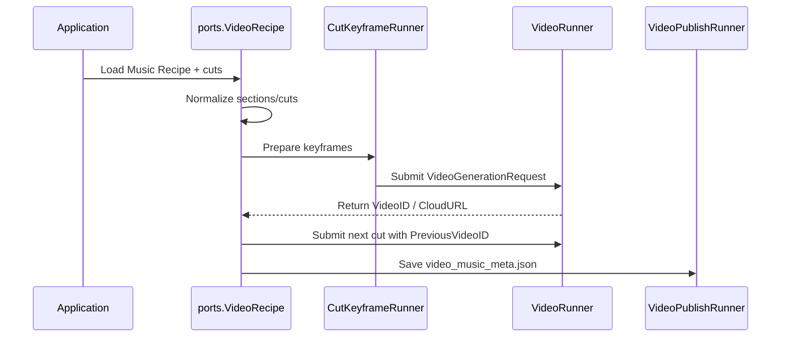

# 🏗️ Architecture - go-veo-orchestrator Showcase

**AI Video Timeline Orchestrator** は、[`github.com/shouni/go-veo-orchestrator`](https://github.com/shouni/go-veo-orchestrator) の workflow library を紹介するための showcase です。

このドキュメントでは、showcase 側が独自の workflow interface を作らず、`go-veo-orchestrator/ports` と一致した境界を使う前提で整理します。

---

## 🚀 設計方針 (Design Goals)

* **🎼 Recipe First**:
  * 入力は `ports.VideoRecipe` として扱い、`music_recipe`、`sections`、`cuts` を同じ JSON に保持します。
* **🎞️ Cut-Based Execution**:
  * 動画全体を一括生成せず、`ports.Cut` 単位で `ports.VideoGenerationRequest` を作り、生成結果を cut metadata に戻します。
* **🔁 Continuity by VideoID**:
  * 直前の `VideoID` を次の `PreviousVideoID` として渡し、Veo の Video-to-Video 文脈を adapter 側で利用できるようにします。
* **🧩 Upstream Ports Boundary**:
  * `pkg/orchestrator` は `go-veo-orchestrator/ports` の型 alias です。型・フィールド・interface を showcase 側で再定義しません。
* **🧭 Resumable Workflow**:
  * `pending` / `generated` / `failed` と `video_id` / `video_url` によって途中停止後の resume や retry を構成できます。
* **🛡️ Public-Safe Surface**:
  * production prompt、API payload、cloud resource name、secret、queue worker、独自 retry policy はこの showcase に含めません。

---

## 🔄 Flow



### Step Details

1. `Application` が creative brief または serialized recipe を読み込みます。
2. `VideoRecipe.Normalize()` が project title、music recipe、cuts、timeline を補完します。`cuts` が空の場合は `music_recipe.sections` から生成します。
3. `CutKeyframeRunner` が必要に応じて `KeyframeReference` を作成または添付します。
4. `VideoRunner` が `VideoGenerationRequest` を受け取り、provider-specific な動画生成処理を実行します。
5. `VideoResponse` から `VideoID` / `CloudURL` を `Cut.VideoID` / `Cut.VideoURL` へ反映します。
6. 次の cut には前 cut の `VideoID` を `PreviousVideoID` として渡します。
7. `VideoPublishRunner` が更新済みの `VideoRecipe` を `video_music_meta.json` として保存します。

---

## 🧭 Public Boundary

この showcase の public boundary は `go-veo-orchestrator/ports` です。

```go
type VideoRunner interface {
    Run(ctx context.Context, req VideoGenerationRequest) (*VideoResponse, error)
}

type VideoTimelineRunner interface {
    Run(ctx context.Context, recipe *VideoRecipe) ([]*VideoResponse, error)
    RunAndSave(ctx context.Context, recipe *VideoRecipe, outputPath string) (*VideoPlotResponse, error)
}

type VideoPublishRunner interface {
    Run(ctx context.Context, recipe *VideoRecipe, outputDir string) (*PublishResult, error)
    BuildMetadata(recipe *VideoRecipe) ([]byte, error)
}
```

### Public Models

* `VideoRecipe`: Music Recipe と動画 cuts を保持する recipe
* `Cut`: 1つの timeline segment
* `VideoGenerationRequest`: Veo adapter に渡すマルチモーダル request
* `VideoResponse`: 生成動画の `VideoID` / `CloudURL` などの metadata
* `VideoRunner`: 1 cut の動画生成 backend adapter interface
* `CutKeyframeRunner`: cut keyframe 生成 workflow
* `VideoPublishRunner`: metadata publish workflow

### Facade Package

`pkg/orchestrator` は以下のように `ports` を alias します。

```go
type VideoRecipe = ports.VideoRecipe
type Cut = ports.Cut
type VideoGenerationRequest = ports.VideoGenerationRequest
type VideoResponse = ports.VideoResponse
type VideoRunner = ports.VideoRunner
type Config = ports.Config
```

このため `pkg/orchestrator.VideoRecipe` は `ports.VideoRecipe` と Go の型として同一です。

---

## 🎞️ Timeline Model

`VideoRecipe` は upstream の `ports.VideoRecipe` と一致します。

```go
type VideoRecipe struct {
    ProjectTitle string      `json:"project_title,omitempty"`
    Description  string      `json:"description,omitempty"`
    MusicRecipe  MusicRecipe `json:"music_recipe"`
    Cuts         []Cut       `json:"cuts"`
}
```

音楽側の `title`、`theme`、`mood`、`tempo`、`sections` は `MusicRecipe` に集約します。`ProjectTitle` が空なら `MusicRecipe.Title`、`MusicRecipe.Title` が空なら `ProjectTitle` が fallback として補完されます。

`Cut` は生成単位として扱う最小の timeline segment です。

```go
type Cut struct {
    CutIndex          int       `json:"cut_index"`
    DurationSec       float64   `json:"duration_sec"`
    AudioCue          string    `json:"audio_cue"`
    AudioReference    string    `json:"audio_reference,omitempty"`
    VisualAnchor      string    `json:"visual_anchor"`
    CharacterID       string    `json:"character_id"`
    Dialogue          string    `json:"dialogue,omitempty"`
    KeyframeReference string    `json:"keyframe_reference,omitempty"`
    VideoURL          string    `json:"video_url,omitempty"`
    VideoID           string    `json:"video_id,omitempty"`
    Status            CutStatus `json:"status,omitempty"`
    StartSec          float64   `json:"start_sec,omitempty"`
    EndSec            float64   `json:"end_sec,omitempty"`
}
```

`VideoGenerationRequest` は adapter に渡す入力です。

```go
type VideoGenerationRequest struct {
    Prompt          string
    ImageReference  string
    AudioReference  string
    InputImage      []byte
    InputAudio      []byte
    PreviousVideoID string
    Seed            int64
    CutIndex        int
    DurationSec     float64
}
```

---

## 🔁 Continuity Strategy

カット間の連続性は `PreviousVideoID` で表現します。

```go
req := orchestrator.VideoGenerationRequest{
    Prompt:          cut.VisualAnchor,
    ImageReference:  cut.KeyframeReference,
    AudioReference:  cut.AudioReference,
    PreviousVideoID: lastVideoID,
    CutIndex:        cut.CutIndex,
    DurationSec:     cut.DurationSec,
}
```

`VideoRunner` が返した `VideoResponse.VideoID` は、次 cut の `PreviousVideoID` として渡します。

---

## 🧭 Resume Strategy

生成状態は `CutStatus` によって表現します。

```go
const (
    CutStatusPending   CutStatus = "pending"
    CutStatusGenerated CutStatus = "generated"
    CutStatusFailed    CutStatus = "failed"
)
```

### Status Meaning

* `pending`: まだ生成が必要な cut
* `generated`: 生成済みで、`VideoID` と `VideoURL` を利用できる cut
* `failed`: 失敗済みで、アプリケーション側の retry policy に従って再処理する cut

### Resume Example

```go
lastVideoID := ""

for i := range recipe.Cuts {
    cut := &recipe.Cuts[i]
    if cut.IsGenerated() {
        lastVideoID = cut.VideoID
        continue
    }

    req := orchestrator.VideoGenerationRequest{
        Prompt:          cut.VisualAnchor,
        ImageReference:  cut.KeyframeReference,
        AudioReference:  cut.AudioReference,
        PreviousVideoID: lastVideoID,
        CutIndex:        cut.CutIndex,
        DurationSec:     cut.DurationSec,
    }

    res, err := runner.Run(ctx, req)
    if err != nil {
        cut.Status = orchestrator.CutStatusFailed
        continue
    }

    cut.VideoID = res.VideoID
    cut.VideoURL = res.CloudURL
    cut.Status = orchestrator.CutStatusGenerated
    lastVideoID = res.VideoID
}
```

この showcase は status field を使ったメタデータ表現を示しますが、retry 回数、backoff、dead-letter queue、partial failure recovery は規定しません。

---

## 🧩 Adapter Implementation Pattern

本番 adapter は `VideoRunner` を実装します。

```go
type ProviderVideoRunner struct {
    // client, storage, logger, retry policy, and configuration live here.
}

func (r *ProviderVideoRunner) Run(ctx context.Context, req orchestrator.VideoGenerationRequest) (*orchestrator.VideoResponse, error) {
    // 1. Convert provider-neutral request into provider-specific payload.
    // 2. Submit generation request.
    // 3. Poll or wait for completion.
    // 4. Store or normalize output reference.
    // 5. Return provider-neutral response.
    return &orchestrator.VideoResponse{}, nil
}
```

adapter は以下の変換責務を持ちます。

* `Prompt` を provider-specific prompt field へ変換
* `DurationSec` を対応する duration parameter へ変換
* `ImageReference` / `AudioReference` / `PreviousVideoID` を provider input asset として解決
* public metadata に載せられる `VideoID` / `CloudURL` へ正規化

---

## 🚫 Non-Goals

この architecture は、以下を目的にしていません。

* 特定 provider の API payload を公開すること
* production prompt template を公開すること
* cloud storage や queue の実装を固定すること
* retry policy を showcase 側で強制すること
* 認証・認可・secret management を public package に持ち込むこと
* 動画生成品質そのものを保証すること

---

## 📂 Related Files

```text
docs/architecture.md          # この設計ドキュメント
examples/recipe.example.json  # ports.VideoRecipe の最小例
pkg/orchestrator/types.go     # go-veo-orchestrator/ports の型 alias
pkg/orchestrator/mock_runner.go
```
