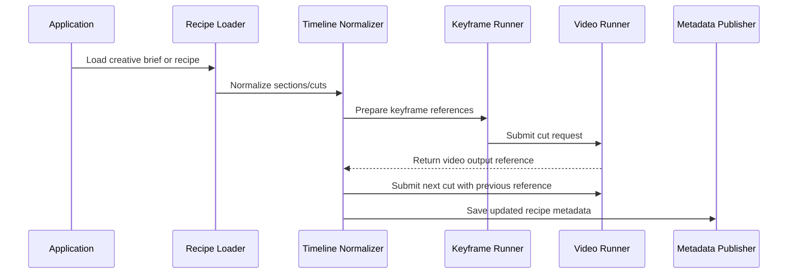

# 🏗️ Architecture - Provider-neutral AI Video Timeline Orchestration

**AI Video Timeline Orchestrator** の architecture は、音楽・ストーリー起点の creative recipe を、AI動画生成バックエンドへ安全に渡せる timeline request に変換することを目的にしています。

このドキュメントでは、公開リポジトリに含めるべき安定した境界と、private implementation に残すべき provider-specific な責務を分離して整理します。

---

## 🚀 設計方針 (Design Goals)

* **🎼 Recipe First**:
  * 入力は `VideoRecipe` として扱い、title、theme、mood、tempo、cut-level prompt を provider-neutral な形で保持します。
* **🎞️ Cut-Based Execution**:
  * 動画全体を一括生成するのではなく、`VideoCut` 単位で request を作り、生成結果を metadata に反映します。
* **🔁 Continuity by Reference**:
  * 直前の `GeneratedVideoRef` を次の `PreviousVideoRef` として渡し、カット間の連続性を adapter 側で利用できるようにします。
* **🧩 Adapter Boundary**:
  * 本番の動画生成 API、polling、storage、認証、rate limit は `VideoRunner` の実装へ隔離します。
* **🧭 Resumable Workflow**:
  * 各カットに `pending` / `generated` / `failed` を持たせ、途中停止後の resume や retry をアプリケーション側で構成できるようにします。
* **🛡️ Public-Safe Surface**:
  * production prompt、API payload、cloud resource name、secret、queue worker、独自 retry policy は公開 API に含めません。

---

## 🔄 Flow



### Step Details

1. `Application` が creative brief または serialized recipe を読み込みます。
2. `Recipe Loader` が `VideoRecipe` として title、theme、mood、tempo、cuts を復元します。
3. `Timeline Normalizer` が sections や cuts を、生成しやすい順序付き timeline に整えます。
4. `Keyframe Runner` が必要に応じて `KeyframeReference` を作成または添付します。
5. `Video Runner` が `VideoRequest` を受け取り、provider-specific な動画生成処理を実行します。
6. `Timeline` は `VideoResponse` から `GeneratedVideoRef` / `GeneratedVideoURL` を更新します。
7. 次の cut には前 cut の `GeneratedVideoRef` を `PreviousVideoRef` として渡します。
8. `Metadata Publisher` が更新済みの `VideoRecipe` を保存します。

---

## 🧭 Public Boundary

公開 API は、長期的に安定しやすい domain concept のみを扱います。

```go
type VideoRunner interface {
    Run(ctx context.Context, req VideoRequest) (*VideoResponse, error)
}

type MetadataPublisher interface {
    Publish(ctx context.Context, recipe VideoRecipe) error
}
```

### Public Models

* `VideoRecipe`: 動画全体の creative recipe
* `VideoCut`: 1つの timeline segment
* `VideoRequest`: provider adapter に渡す生成 request
* `VideoResponse`: provider adapter から返す生成 result
* `VideoRunner`: 動画生成 backend の adapter interface
* `MetadataPublisher`: recipe metadata の保存 interface

### Private / Adapter Responsibilities

以下は公開 API には含めず、private package または別 adapter package に隔離します。

* provider-specific HTTP request / response payload
* authentication and token refresh
* polling and operation state management
* storage upload / signed URL generation
* prompt template expansion
* rate limit and quota handling
* retry / backoff / dead-letter policy
* queue worker and deployment configuration
* cloud project ID, bucket path, secret name

---

## 🎞️ Timeline Model

`VideoRecipe` は、音楽・ストーリー起点の動画構成を provider-neutral に表現します。

```go
type VideoRecipe struct {
    Title    string     `json:"title"`
    Theme    string     `json:"theme,omitempty"`
    Mood     string     `json:"mood,omitempty"`
    TempoBPM int        `json:"tempo_bpm,omitempty"`
    Cuts     []VideoCut `json:"cuts"`
}
```

`VideoCut` は、生成単位として扱う最小の timeline segment です。

```go
type VideoCut struct {
    Index             int       `json:"index"`
    DurationSec       float64   `json:"duration_sec"`
    AudioCue          string    `json:"audio_cue,omitempty"`
    AudioReference    string    `json:"audio_reference,omitempty"`
    VisualPrompt      string    `json:"visual_prompt"`
    KeyframeReference string    `json:"keyframe_reference,omitempty"`
    CharacterID       string    `json:"character_id,omitempty"`
    Seed              uint32    `json:"seed,omitempty"`
    PreviousVideoRef  string    `json:"previous_video_ref,omitempty"`
    GeneratedVideoRef string    `json:"generated_video_ref,omitempty"`
    GeneratedVideoURL string    `json:"generated_video_url,omitempty"`
    Status            CutStatus `json:"status,omitempty"`
}
```

---

## 🔁 Continuity Strategy

カット間の連続性は、provider-specific な詳細ではなく reference chaining として表現します。

```go
req := orchestrator.VideoRequestFromCut(cut, previousVideoRef)
```

`previousVideoRef` が指定されている場合は、それを優先して `VideoRequest.PreviousVideoRef` に設定します。指定がない場合は、`VideoCut.PreviousVideoRef` を fallback として使います。

この設計により、呼び出し側は以下を選べます。

* recipe に保存済みの previous reference を使う
* 実行中に得た直前の generated reference を明示的に渡す
* adapter 側で reference を provider-specific input に変換する

---

## 🧭 Resume Strategy

生成状態は `CutStatus` によって表現します。

```go
const (
    CutStatusPending   CutStatus = "pending"
    CutStatusGenerated CutStatus = "generated"
    CutStatusFailed    CutStatus = "failed"
)
```

### Status Meaning

* `pending`: まだ生成が必要な cut
* `generated`: 生成済みで、`GeneratedVideoRef` または `GeneratedVideoURL` を利用できる cut
* `failed`: 失敗済みで、アプリケーション側の retry policy に従って再処理する cut

### Resume Example

```go
previousRef := ""

for i, cut := range recipe.Cuts {
    if cut.Status == orchestrator.CutStatusGenerated {
        previousRef = cut.GeneratedVideoRef
        continue
    }

    req := orchestrator.VideoRequestFromCut(cut, previousRef)
    res, err := runner.Run(ctx, req)
    if err != nil {
        recipe.Cuts[i].Status = orchestrator.CutStatusFailed
        continue
    }

    recipe.Cuts[i].GeneratedVideoRef = res.VideoRef
    recipe.Cuts[i].GeneratedVideoURL = res.VideoURL
    recipe.Cuts[i].Status = orchestrator.CutStatusGenerated
    previousRef = res.VideoRef
}
```

この public sample は status field を定義しますが、retry 回数、backoff、dead-letter queue、partial failure recovery は規定しません。

---

## 🧩 Adapter Implementation Pattern

本番 adapter は `VideoRunner` を実装します。

```go
type ProviderVideoRunner struct {
    // client, storage, logger, retry policy, and configuration live here.
}

func (r *ProviderVideoRunner) Run(ctx context.Context, req orchestrator.VideoRequest) (*orchestrator.VideoResponse, error) {
    // 1. Convert provider-neutral request into provider-specific payload.
    // 2. Submit generation request.
    // 3. Poll or wait for completion.
    // 4. Store or normalize output reference.
    // 5. Return provider-neutral response.
    return &orchestrator.VideoResponse{}, nil
}
```

adapter は以下の変換責務を持ちます。

* `Prompt` を provider-specific prompt field へ変換
* `DurationSec` を対応する duration parameter へ変換
* `AudioReference` / `KeyframeReference` / `PreviousVideoRef` を provider input asset として解決
* provider operation ID を `ProviderOperation` に保持
* public metadata に載せられる `VideoRef` / `VideoURL` へ正規化

---

## 🚫 Non-Goals

この architecture は、以下を目的にしていません。

* 特定 provider の API payload を公開すること
* production prompt template を公開すること
* cloud storage や queue の実装を固定すること
* retry policy をライブラリ側で強制すること
* 認証・認可・secret management を public package に持ち込むこと
* 動画生成品質そのものを保証すること

---

## 📂 Related Files

```text
docs/architecture.md          # この設計ドキュメント
examples/recipe.example.json  # creative recipe の最小例
pkg/orchestrator/interfaces.go
pkg/orchestrator/types.go
pkg/orchestrator/mock_runner.go
```
